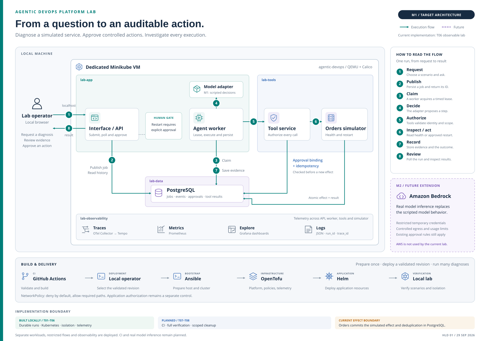

# Agentic DevOps Platform Lab

A hands-on lab for building and operating a local platform for an operational
diagnosis agent. The project combines Kubernetes, infrastructure as code,
network isolation, observability, and controlled failure scenarios with a guided
learning workflow.

The target use case is a fictional orders service: ask why it is failing, inspect
the tools used during diagnosis, correlate execution with logs and traces, and
verify that unauthorized connections and actions are rejected.

## Current status

**T01–T06 are implemented and verified locally:** the durable simulated diagnosis
application runs in a dedicated QEMU/Calico Kubernetes cluster. Ansible bootstrap,
OpenTofu platform resources, Helm deployment, persistent storage, and network
isolation have executed acceptance evidence. Correlated logs, metrics, traces,
Grafana dashboards and controlled failures are deployed. CI is the next increment.

The platform includes separate API, worker, tool gateway and orders workloads;
authenticated tools; approval-bound simulated restart; durable recovery and
execution limits; and restricted database permissions. Tests cover application
contracts, cluster behavior, allowed/denied connectivity, and authorization over
an allowed connection. See [PROGRESS.md](docs/PROGRESS.md) for exact results.

## Run the Kubernetes platform

```sh
make doctor
make bootstrap
make infra-plan
make infra-apply
make deploy
make verify-cluster
make verify-network
make verify-observability
make ui
```

Inspect the plan before applying. Open <http://127.0.0.1:8080> and enter `user_token`
from the private `data/platform/credentials.json` file. Read the
[platform demonstration](docs/PLATFORM_DEMO.md) for prerequisites, ownership,
credentials, verification, and stopping the dedicated VM. All platform commands
use a private kubeconfig and explicit lab context; unrelated profiles are preserved.

## Inspect observability and controlled failures

```sh
make dashboards
# In another terminal:
make scenario CASE=tool-timeout
make logs RUN_ID=<run-uuid>
make reset
```

Open <http://127.0.0.1:3000/d/agentic-devops>. Use the returned trace ID in
Grafana Explore with the Tempo datasource. The dashboard separates availability,
diagnosis outcomes and scenario correctness. Read the
[observability guide](docs/OBSERVABILITY_DEMO.md) for all six scenarios, telemetry
retention, approval behavior and verification commands.

## Try the local simulation

```sh
make run
```

Open <http://127.0.0.1:8080>, choose a scenario, and run a diagnosis. Use Ctrl+C to
stop, or `make run PORT=8081` to use another port. The application uses Python's
standard library, so no application packages or cluster are needed for this step.

`make verify-local` automatically checks A04 and writes `artifacts/a04-local.json`.
See the [local demonstration](docs/LOCAL_DEMO.md) for expected results and HTTP
examples. History is held in memory for up to 100 runs and disappears on restart.
The scripted adapter records the question but does not interpret it. It always
calls the orders health tool; no restart or cloud/cluster action is available.

## Try durable execution

With native PostgreSQL 16 tools installed:

```sh
make setup
make verify-durable
make run-durable
```

Open <http://127.0.0.1:8080> and enter `user_token` from the private local settings
file identified at startup. Scenarios include an explicit simulated restart
approval, dependency timeout, and repeated tool calls. History survives restart.
See [DURABLE_DEMO.md](docs/DURABLE_DEMO.md) for credentials, limits, API examples,
and verification boundaries. `Ctrl+C` stops the owned services and database.

## Architecture

Start with the [high-level design](docs/HIGH_LEVEL_DESIGN.md) for the complete
user journey, architecture diagrams, approval flow, platform delivery,
observability, and the boundary between current functionality and future stages.

The diagram shows the M1 architecture and M2 extension. T04–T06
deploy separate API, worker, tool gateway, orders, and database workloads with
restricted network flows. The orders service owns the transaction containing
the simulated restart, approval consumption, and deduplication result. The model
adapter remains a component of the worker. Collector, Prometheus, Tempo and Grafana are deployed by T06.

M1 uses deterministic responses and tool calls visibly labeled **SIMULATED**.
It demonstrates platform operations and tool contracts; real model integration
belongs to M2.



[High-resolution PNG](docs/assets/architecture-overview.png) ·
[Editable SVG](docs/assets/architecture-overview.svg) ·
[Diagram source and export instructions](docs/assets/README.md)

The durable worker claims jobs from PostgreSQL using atomic leases. The tool
service validates identity, scope, arguments, approval, and idempotency. Simulated
restart requires explicit user approval. Durable events are available by run ID;
T06 correlates JSON logs, metrics and distributed traces. See [ADR 0003](docs/decisions/0003-durable-execution.md).

| Technology | Planned responsibility |
| --- | --- |
| Minikube and QEMU | Dedicated local Kubernetes VM |
| Calico | Enforce Kubernetes NetworkPolicies between workloads |
| Ansible | Bootstrap prerequisites and prepare the lab profile |
| OpenTofu | Manage platform resources and observability releases |
| Helm | Deploy application resources |
| Python and PostgreSQL | Interface/API, worker, tools, execution history, and approvals |
| OpenTelemetry, Prometheus, Grafana, Tempo | Collect and inspect operational telemetry |
| GitHub Actions | Validate code and infrastructure, run tests, and build images |

## Getting started

The initial baseline targets **Linux x86_64**, Python **3.11+**, and GNU Make.
The host should have at least 16 GiB RAM and 30 GiB free disk. The planned lab VM
uses four CPUs and 8 GiB RAM. QEMU requires usable KVM access on this host.

Clone the repository and run the checks:

```sh
git clone https://github.com/marcossabatino/agentic-devops.git
cd agentic-devops
make test
make doctor
```

The T02 demo and regression tests use the standard library. T03 requires the
pinned dependencies in `requirements.txt` and native PostgreSQL tools.
HTTP tests use temporary localhost servers. Exact platform CLI pins are in
[config/lab.json](config/lab.json).

`make doctor` does not install tools, start a VM, change the current context, or
contact a Kubernetes API. Ansible's version check uses a temporary directory that
is removed afterwards. Missing tools, version mismatches, or conflicting lab
profile settings produce a nonzero exit. An absent lab profile is expected before
bootstrap. A sandbox may hide `/dev/kvm`; check host access before interpreting
that result as a broken QEMU installation.

Available targets are `make doctor`, `make test`, `make run`, `make verify-local`,
`make setup`, `make run-durable`, `make verify-durable`, `make bootstrap`,
`make infra-plan`, `make infra-apply`, `make deploy`, `make ui`,
`make verify-cluster`, `make verify-network`, `make dashboards`, `make scenario`,
`make reset`, `make logs`, and `make verify-observability`. CI, consolidated
acceptance and scoped cleanup remain T07–T08.

## Isolation and access design

The selected profile is `agentic-devops`, with driver `qemu2` and network `builtin`.
The interface is accessible through a localhost port-forward; dashboard access
uses the same local access pattern. This QEMU network does not support `minikube service` or
`minikube tunnel`; see the [QEMU decision](docs/decisions/0001-qemu-lab-profile.md).

T03–T05 implement restricted database permissions, authenticated tool calls,
bounded execution, approval-bound actions, idempotency keys, and tested
default-deny network policies. VM isolation does not replace pod network policies or
application authorization. The agent will not receive unrestricted shell access
or cluster administrator credentials.

The [.gitignore](.gitignore) excludes local credentials, kubeconfigs, environment
files, IaC state and plans, VM images, database files, and generated artifacts.
Keep sanitized examples, source manifests, SQL migrations, dependency lock files,
and curated validation evidence under version control. Ignore rules do not remove
files already tracked by Git; inspect staged changes before committing.

## Roadmap and learning workflow

- **M1 — Verifiable local platform:** simulated execution, reproducible deployment,
  network and authorization tests, telemetry, controlled failures, and CI.
- **M2 — AWS integration:** Amazon Bedrock, restricted temporary credentials,
  separate AWS infrastructure/state, GitHub OIDC, and model usage/cost visibility.
- **M3 — Optional extensions:** Datadog export, an authenticated MCP tool,
  a dedicated self-hosted runner, and retrieval/architecture experiments.

Work proceeds one learning increment at a time. Each checkpoint records completed
work, executed validation, an architectural decision, pending tasks, and a learning
question. This is a local educational lab, not a production platform.

| Document | Purpose |
| --- | --- |
| [PRD](docs/prd.md) | Scope, ownership boundaries, scenarios, and acceptance criteria |
| [Observability demonstration](docs/OBSERVABILITY_DEMO.md) | Correlate runs, logs and traces; exercise controlled failures |
| [Observability decision](docs/decisions/0005-observability-and-controlled-failures.md) | Trace propagation, metrics, retention and scenario/reset semantics |
| [Platform demonstration](docs/PLATFORM_DEMO.md) | Bootstrap, deploy and verify the isolated Kubernetes lab |
| [Platform decision](docs/decisions/0004-local-platform-and-network.md) | Resource ownership, effect transaction, and network flows |
| [High-level design](docs/HIGH_LEVEL_DESIGN.md) | Complete solution, architecture diagrams, execution flow, and current versus target capabilities |
| [Implementation plan](docs/IMPLEMENTATION_PLAN.md) | Task backlog mapped to acceptance criteria |
| [Progress](docs/PROGRESS.md) | Last verified checkpoint and next task |
| [QEMU decision](docs/decisions/0001-qemu-lab-profile.md) | Driver selection, version baseline, and networking constraints |
| [Local execution decision](docs/decisions/0002-local-simulated-execution.md) | T02 component boundaries and transition to durable execution |
| [Local demonstration](docs/LOCAL_DEMO.md) | Run the in-memory interface |
| [Durable demonstration](docs/DURABLE_DEMO.md) | Run PostgreSQL, exercise approval and execution limits |
| [Durable execution decision](docs/decisions/0003-durable-execution.md) | Claims, recovery, authorization, and transaction boundaries |

## License

This project is licensed under the [MIT License](LICENSE).
