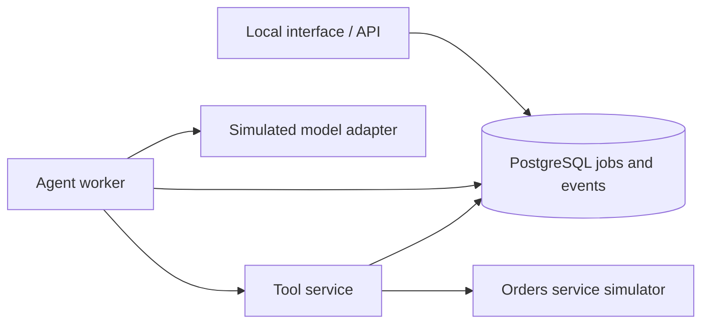

# Agentic DevOps Platform Lab

A hands-on lab for building and operating a local platform for an operational
diagnosis agent. The project combines Kubernetes, infrastructure as code,
network isolation, observability, and controlled failure scenarios with a guided
learning workflow.

The target use case is a fictional orders service: ask why it is failing, inspect
the tools used during diagnosis, correlate execution with logs and traces, and
verify that unauthorized connections and actions are rejected.

## Current status

**Early implementation: local prerequisite checks are available.** The application,
lab cluster, infrastructure automation, dashboards, and CI workflows are still
planned. No end-to-end acceptance scenario has passed yet.

Implemented and verified:

- A dedicated QEMU (`qemu2`) Minikube profile configuration in
  [config/lab.json](config/lab.json).
- `make doctor` for host capacity, KVM access, CLI versions, existing lab profile
  settings, and the local kubectl context.
- Eight automated tests for the prerequisite checker.
- A scope baseline, implementation backlog, progress record, and QEMU decision.

The last host check found OpenTofu missing from `PATH`. The new `agentic-devops`
profile has not been created. Existing profiles and unrelated Kubernetes contexts
remain untouched. See [PROGRESS.md](docs/PROGRESS.md) for the actual validation
evidence and next task.

## Planned architecture

M1 uses deterministic responses and tool calls visibly labeled **SIMULATED**.
It demonstrates platform operations and tool contracts; real model integration
belongs to M2.



The worker will claim jobs from PostgreSQL using atomic leases. The tool service
will validate identity, scope, arguments, approval, and idempotency before executing
an action. A simulated restart will require explicit user approval. Operational
events will be correlated through logs, metrics, and traces.

| Technology | Planned responsibility |
| --- | --- |
| Minikube and QEMU | Dedicated local Kubernetes VM |
| Calico | Enforce Kubernetes NetworkPolicies between workloads |
| Ansible | Bootstrap prerequisites and prepare the lab profile |
| OpenTofu | Manage platform resources and observability releases |
| Helm | Deploy application resources |
| Python and PostgreSQL | Interface/API, worker, tools, execution history, and approvals |
| OpenTelemetry, Prometheus, Grafana, Tempo | Collect and inspect operational telemetry |
| GitHub Actions | Validate code and infrastructure, run tests, and build images |

## Getting started

The initial baseline targets **Linux x86_64**, Python **3.11+**, and GNU Make.
The host should have at least 16 GiB RAM and 30 GiB free disk. The planned lab VM
uses four CPUs and 8 GiB RAM. QEMU requires usable KVM access on this host.

Clone the repository and run the checks:

```sh
git clone https://github.com/marcossabatino/agentic-devops.git
cd agentic-devops
make test
make doctor
```

The tests use Python's standard library; no Python dependencies need to be
installed for this checkpoint. Exact platform CLI pins are in
[config/lab.json](config/lab.json).

`make doctor` does not install tools, start a VM, change the current context, or
contact a Kubernetes API. Ansible's version check uses a temporary directory that
is removed afterwards. Missing tools, version mismatches, or conflicting lab
profile settings produce a nonzero exit. An absent lab profile is expected before
bootstrap. A sandbox may hide `/dev/kvm`; check host access before interpreting
that result as a broken QEMU installation.

Only `make doctor` and `make test` are implemented. Bootstrap, deployment,
verification, UI access, and cleanup commands described in the PRD are future
implementation contracts. A passing prerequisite check does not prove cluster
readiness or application correctness.

## Isolation and access design

The selected profile is `agentic-devops`, with driver `qemu2` and network `builtin`.
The planned interface and dashboards will be accessible through localhost
port-forwards. This QEMU network does not support `minikube service` or
`minikube tunnel`; see the [QEMU decision](docs/decisions/0001-qemu-lab-profile.md).

The planned controls include default-deny network policies, restricted database
permissions, authenticated tool calls, bounded execution, approval-bound actions,
and idempotency keys. VM isolation does not replace pod network policies or
application authorization. The agent will not receive unrestricted shell access
or cluster administrator credentials.

The [.gitignore](.gitignore) excludes local credentials, kubeconfigs, environment
files, IaC state and plans, VM images, database files, and generated artifacts.
Keep sanitized examples, source manifests, SQL migrations, dependency lock files,
and curated validation evidence under version control. Ignore rules do not remove
files already tracked by Git; inspect staged changes before committing.

## Roadmap and learning workflow

- **M1 — Verifiable local platform:** simulated execution, reproducible deployment,
  network and authorization tests, telemetry, controlled failures, and CI.
- **M2 — AWS integration:** Amazon Bedrock, restricted temporary credentials,
  separate AWS infrastructure/state, GitHub OIDC, and model usage/cost visibility.
- **M3 — Optional extensions:** Datadog export, an authenticated MCP tool,
  a dedicated self-hosted runner, and retrieval/architecture experiments.

Work proceeds one learning increment at a time. Each checkpoint records completed
work, executed validation, an architectural decision, pending tasks, and a learning
question. This is a local educational lab, not a production platform.

| Document | Purpose |
| --- | --- |
| [PRD](docs/prd.md) | Scope, ownership boundaries, scenarios, and acceptance criteria |
| [Implementation plan](docs/IMPLEMENTATION_PLAN.md) | Task backlog mapped to acceptance criteria |
| [Progress](docs/PROGRESS.md) | Last verified checkpoint and next task |
| [QEMU decision](docs/decisions/0001-qemu-lab-profile.md) | Driver selection, version baseline, and networking constraints |

## License

This project is licensed under the [MIT License](LICENSE).
