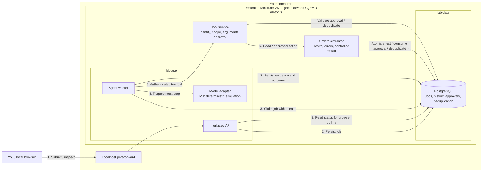
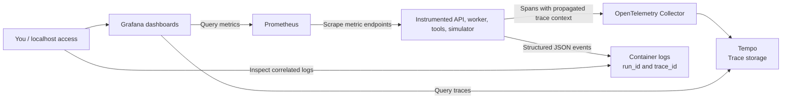
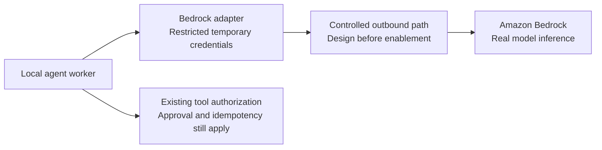

# High-level design — Agentic DevOps Platform Lab

Date: 2026-09-29. Design baseline: [PRD v0.2](prd.md).

This document describes the complete intended solution and distinguishes it from
the implemented T06 checkpoint. **The diagrams include the complete target**.
Kubernetes application deployment and network isolation are verified; distributed
observability is deployed by T06; CI and AWS remain future work.


[Open the presentation PNG](assets/architecture-overview.png) ·
[Open the editable SVG](assets/architecture-overview.svg) ·
[Regenerate the artwork](assets/README.md)

## 1. What the solution does

The lab provides a local interface for investigating a fictional orders service.
You select a failure scenario, request a diagnosis, inspect the evidence gathered
by tools, and, when appropriate, approve a simulated corrective action. Each
execution has an ID, a persisted history, an outcome, and bounded execution time.

Example: orders returns HTTP 503. You ask why, the execution inspects synthetic
health data, and the interface explains the degraded condition. In a scenario
that requires a restart, it displays the exact proposed action and waits for
your approval. After approval, the tool performs one simulated effect and the
interface displays the result. Repeating a request must not duplicate that effect.

At the end of M1, you will also be able to rebuild the local platform, inject
failures, follow an execution through telemetry, demonstrate allowed and denied
connections/actions, validate the source revision, and remove only lab resources.

The learning outcome is operating and explaining a small agent platform across
application, infrastructure, security, reliability, and delivery boundaries.

| Stage | User-visible capability | Meaning of the agent |
| --- | --- | --- |
| M1 — Local platform | Reproducible diagnosis and controlled failure scenarios | Scripted tool selection and synthetic observations, visibly `SIMULATED`; the question is recorded, not interpreted |
| M2 — AWS integration | A real model interprets the request and proposes tool calls | A Bedrock adapter replaces scripted model behavior; authorization, limits, and human approval still apply |
| M3 — Optional extensions | Additional integration experiments | Possible MCP tool, Datadog export, retrieval, or a dedicated deployment runner; outside the committed M1 scope |

The orders service is a simulator, not an e-commerce implementation. M2 adds
real model inference; it does not automatically authorize actions on real user
systems. Production operation, arbitrary shell execution, cluster administrator
access for the agent, and public internet hosting are outside this lab's scope.

## 2. Application architecture

Read the numbered arrows as the main diagnosis flow. An arrow indicates who
initiates an interaction; the response returns on the same connection. Approval
and telemetry have separate diagrams below.



The API and worker communicate through persisted jobs. The browser receives a
run ID promptly and polls for updates while the worker executes independently.
PostgreSQL holds both the queue and history, so M1 needs no additional broker.

The worker orchestrates work. The model adapter proposes a next step or a final
answer. The tool service owns the permission to execute a tool. A proposal from
the model is never sufficient authorization for a state-changing action.

The adapter is a logical component inside the worker. T04 deploys a separate
orders service, which owns the transaction containing approval consumption, the
simulated restart effect, and deduplication. The tool gateway checks authorization
using read-only records and forwards with its own service credential. Orders has
an explicit database connection as shown above. This preserves
the T03 effect contract; see [ADR 0004](decisions/0004-local-platform-and-network.md).

| Component | Responsibility | What you observe |
| --- | --- | --- |
| Interface / API | Authenticate the lab user, accept requests, persist approval, return history | Scenario, run ID, status, tool evidence, pending action, result |
| Worker | Claim jobs, execute steps, enforce budgets, record results | Attempts, steps, elapsed time, completion or a specific failure |
| Model adapter | Supply scripted decisions in M1 and model-driven decisions in M2 | Explicit simulated/real mode and a concise explanation |
| Tool service | Validate the request independently before invoking an allowed operation | Successful tool result or a rejected request |
| Orders simulator | Produce controlled healthy, degraded, and slow behavior | Repeatable observations and a simulated restart effect |
| PostgreSQL | Preserve job ownership, history, approval, and deduplication records | Recovery after restart and evidence tied to a run ID |

Target tools include reading health, querying synthetic metrics, retrieving a
runbook, and an approval-gated simulated restart. The current implementation provides health and
restart; dedicated metrics-query and runbook tools remain to be implemented.

## 3. Diagnosis and approval flow

```mermaid
sequenceDiagram
    actor User
    participant API as Interface / API
    participant DB as PostgreSQL
    participant Worker
    participant Tools as Tool service

    User->>API: Submit question and scenario
    API->>DB: Create queued run
    API-->>User: Accepted + run ID
    Worker->>DB: Atomically claim run and obtain lease
    Worker->>Tools: Authenticated health request
    Tools-->>Worker: Synthetic health evidence

    alt Diagnosis needs no corrective action
        Worker->>DB: Complete with healthy or degraded outcome
    else Scenario proposes a simulated restart
        Worker->>DB: Persist exact pending action; release lease
        User->>API: Inspect run and proposed action
        API-->>User: Awaiting approval
        Note over User,DB: No restart before an explicit user approval
        User->>API: Approve this run, tool, and arguments
        API->>DB: Record authenticated approval and requeue
        Worker->>DB: Claim approved run
        Worker->>Tools: Restart request + stable idempotency key
        Tools->>DB: Validate binding, expiry, and prior result
        Note over Tools,DB: Orders owner: effect, approval consumption, and result commit together
        Tools-->>Worker: Stored or newly committed simulated result
        Worker->>DB: Complete with evidence
    end

    User->>API: Poll run ID
    API->>DB: Read persisted execution
    API-->>User: Status, evidence, outcome, duration, errors
```

There are two different results to interpret. **Execution status** tells you
whether the diagnosis completed. **Orders outcome** tells you whether the
observed service was healthy. `completed` with `degraded` is a successful
diagnosis of an unhealthy service. A tool timeout instead produces a failed
execution with an explicit reason.

If approval is not given, its waiting window expires. Changing the proposed
arguments invalidates the binding. Repeating an authorized action with its
existing key returns the stored result instead of performing another effect.

## 4. Reliability and security boundaries

| Situation | Intended behavior | Current evidence |
| --- | --- | --- |
| Worker stops after claiming a job | A new worker recovers it after lease expiry; the old owner cannot overwrite the recovered run | Process termination, recovery, and stale-owner rejection tested |
| Worker loses the tool response | Retry with the same key retrieves the committed result | One simulated effect after recovery tested |
| Dependency does not respond | Timeout, bounded retries, then visible failure | Controlled HTTP timeout tested |
| Adapter keeps requesting tools | Stop at the durable step limit | Five-step failure scenario tested |
| Approval is missing, changed, or expired | Reject the state-changing tool | Binding and expiry tested |
| Caller reaches the endpoint without permission | Reject based on identity and scope | Allowed connection with rejected HTTP action tested |
| A forbidden workload attempts a connection | NetworkPolicy blocks the path | T05 literal-IP TCP timeouts and matching positive controls passed |

T03 defaults are five total steps, three total job claims, a 30-second execution
deadline, a three-second lease, a 0.5-second tool timeout, and two transient
retries. Human approval has a separate 300-second window. Limits are configurable.
Recovery preserves consumed steps and claims. Expired jobs are marked failed
when a worker next processes the queue.

The target network starts with denied ingress and egress and permits specific
flows. The API may access its database records. The worker may access jobs, the
adapter, and tools. Only the tool service may invoke the orders simulator.
Required DNS and application paths are explicitly allowed, with matching ingress
and egress. T05 tested allowed and forbidden paths plus workload internet denial.
T06 adds eleven explicit telemetry paths with symmetric ingress/egress policies.

Separate database roles and tool scopes enforce application permissions even
when a connection is allowed. The worker cannot grant itself human approval.
The local operator is trusted to administer the lab and its credentials.

A lease manages ownership of work; idempotency manages duplicate effects.
Neither a retry nor a lease alone proves exactly-once behavior for an external
operation. The current one-effect guarantee is limited to the simulated database
transaction described in [ADR 0003](decisions/0003-durable-execution.md).

## 5. How the platform is created and delivered

Infrastructure tooling prepares and deploys the application; it is not called
for every diagnosis.

```mermaid
flowchart LR
    SRC["Repository / proposed change"] --> CI["GitHub Actions<br/>Checks, tests, image build"]
    CI --> REV["Validated source revision"]
    REV --> OP["Local operator<br/>Select validated revision"]
    OP --> A["Ansible<br/>Prepare host and dedicated Minikube"]
    A --> TF["OpenTofu<br/>Plan / apply platform resources"]
    TF --> H["Helm<br/>Deploy application resources"]
    H --> LAB["Running local lab"]
    LAB --> V["Verification<br/>Readiness, scenarios, isolation, evidence"]
```



| Technology | Ownership in the target solution |
| --- | --- |
| QEMU + Minikube | Dedicated local Kubernetes VM, preserving other profiles |
| Ansible | Host preparation and repeatable cluster bootstrap |
| OpenTofu | Namespaces, quotas, RBAC, NetworkPolicies, and observability releases |
| Helm application chart | Application workloads, Services, service accounts, PostgreSQL StatefulSet/storage, and migration Job |
| Calico | Enforcement of declared Kubernetes NetworkPolicies |
| GitHub Actions | Validate source and build images; identify the checked revision |
| Local deployment commands | Build/load the selected image into Minikube and deploy the selected revision |

OpenTofu and the application chart must not own the same resources. Cluster
creation precedes platform planning. CI does not need access to the laptop's
cluster: M1 deployment is initiated locally. A dedicated self-hosted deployment
runner is only an optional M3 extension.

The target command journey is `doctor` → `bootstrap` → `infra-plan` /
`infra-apply` → `deploy` → `ui` / `dashboards` → `verify` → scoped `destroy`.
Bootstrap, plan/apply, deploy, UI access, cluster verification and network
verification are implemented. Dashboards, consolidated verification and scoped
destruction remain future increments; see the [README](../README.md).

## 6. How you observe a diagnosis



Start with the run ID displayed in the interface. The deployed telemetry connects
that execution to its trace and structured logs. A trace shows where time was
spent: queue handling, model interaction, tool calls, or persistence. Dashboards
show aggregate success/failure, duration, pending jobs, retries, and denials.

Run IDs and questions do not become Prometheus labels. Run IDs correlate logs
and traces; questions remain only in authenticated execution history. The current design does not select an additional
central log-storage product; container logs provide the initial log evidence.

T03 exposes persisted execution events. T06 adds Collector, Prometheus, Tempo,
Grafana and distributed correlation. See the [observability guide](OBSERVABILITY_DEMO.md)
for commands and the limits of ephemeral telemetry retention.

## 7. What changes with AWS in M2

The intended model path becomes:



The local application and operational controls remain. The change is real model
inference, with explicit account, region/model availability, credentials,
outbound access, execution/token limits, and cost visibility. M2 also introduces
separate AWS infrastructure/state and restricted GitHub OIDC for authorized AWS
operations. OIDC does not connect GitHub-hosted runners to the local cluster.

These choices must be agreed before enabling AWS. No AWS resources or model
calls are part of the current delivery. A future move of the entire application
to AWS is a separate architecture exercise, not an implied M2 requirement.

## 8. Current implementation versus complete solution

| Capability | Now: T01–T07 | Remaining work |
| --- | --- | --- |
| Local diagnosis UI and synthetic health evidence | Implemented locally and deployed in Kubernetes, with trace ID in the UI | Continued usability improvements |
| Durable jobs, recovery, authentication, approval, deduplication | Tested with real PostgreSQL, HTTP and deployed services | Continued regression coverage |
| Component isolation | Separate API, worker, tool gateway, orders and PostgreSQL workloads | Adapter remains in the worker; a separate model service is not needed for M1 |
| Dedicated cluster and repeatable deployment | QEMU/Calico, second bootstrap changed=0, OpenTofu no-change plan, Helm and persistent volume verified | Full cleanup and backup workflow remain later scope |
| Network isolation | Default-deny, DNS, seven application and eleven telemetry paths; positive and negative TCP tests | Continued regression coverage |
| Failure evidence | Correlated logs/traces, metrics/dashboard, timeout, step limit, deadline, scenario/reset and recovery tests | Consolidated M1 verification |
| Metrics and runbook tools | Not implemented as dedicated tools | Complete the PRD catalog in T08 before M1 closes |
| CI and deployment provenance | GitHub checks/build, intentional failure evidence and exact successful main SHA enforced at deploy | Registry publication remains outside local M1 |
| Complete acceptance and cleanup | Local, cluster and network test/report commands | T08 consolidated verification, scoped cleanup, ten-minute demonstration |
| Real model inference | No LLM calls | M2 / T09 Bedrock integration |

M1 is complete when the platform can be recreated, scenarios behave as expected,
unauthorized paths/actions fail, runs can be investigated through telemetry,
the deployed revision is identifiable, and cleanup preserves unrelated resources.
The acceptance baseline remains [A01–A13 in the PRD](prd.md#10-scenarios-and-acceptance-criteria).

For executed evidence, read [Progress](PROGRESS.md). To try the deployed
behavior, follow the [platform demonstration](PLATFORM_DEMO.md). For the next
increment, consult the [implementation plan](IMPLEMENTATION_PLAN.md).
